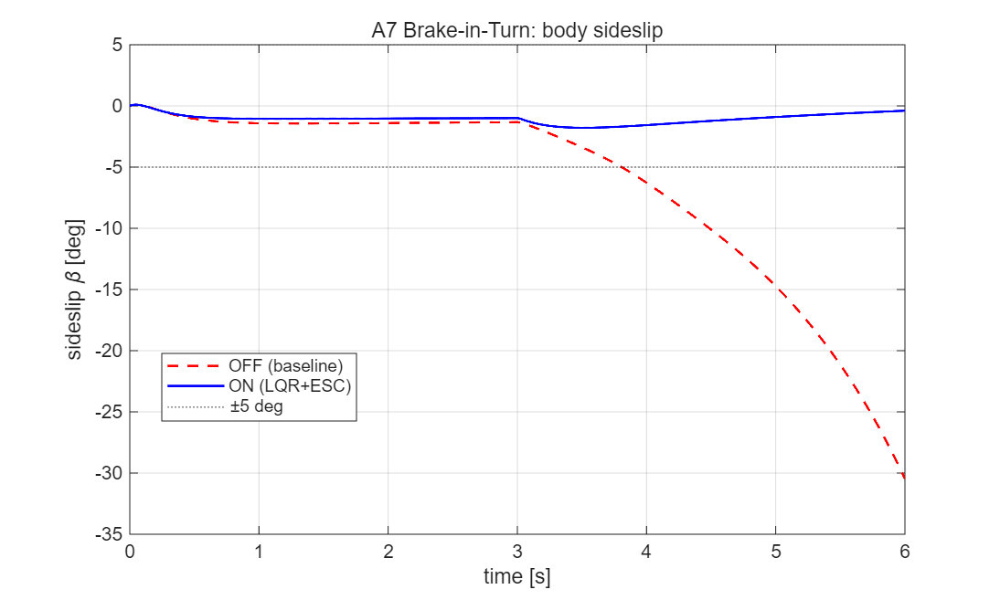
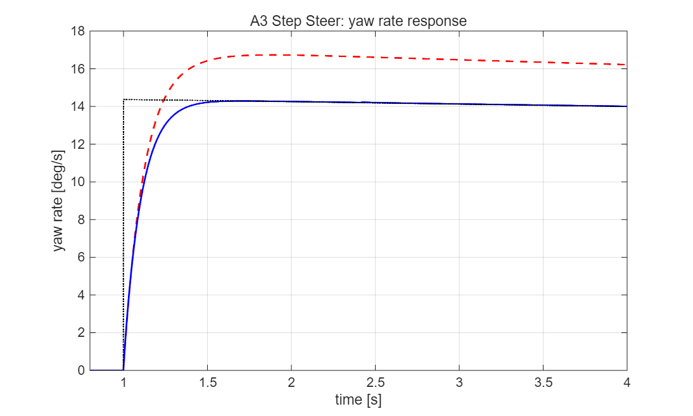
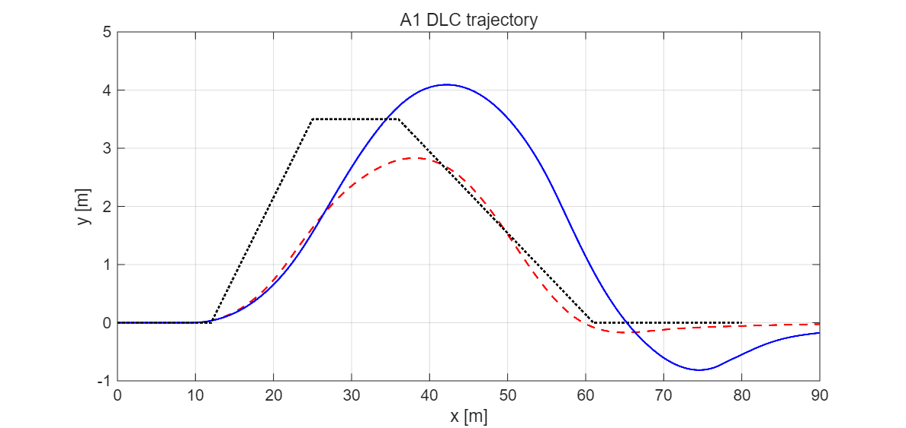
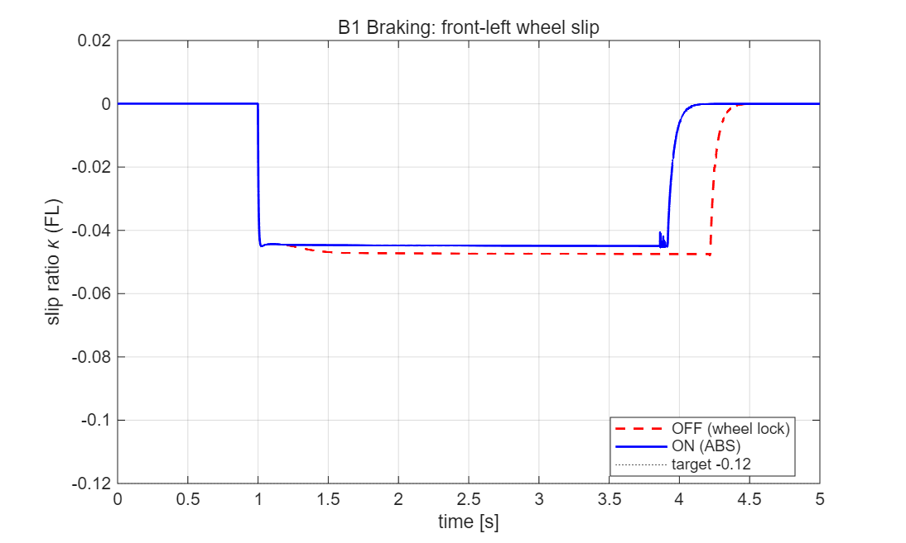
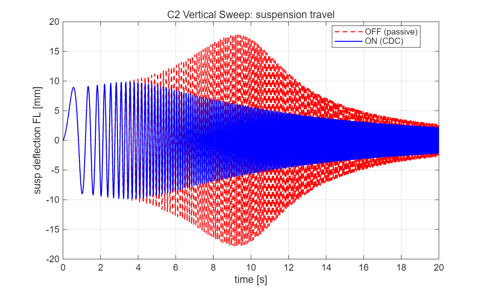

# 통합 섀시 제어(ICC) 제어기 설계 보고서

**과목**: 자동제어 — 2026 봄
**학번 / 이름**: 202624288 / 김현수
**팀**: 개인
**채점 plant**: BMW_5 14DOF (`grade.m` 고정) · 검증 solver: ode45
**정량 자동채점 결과**: **57.16 / 70** (`grade_report.json`)

---

## 1. 설계 개요

본 과제의 목표는 14자유도 차량 동역학 plant 위에서 횡·종·수직 통합 섀시 제어기를 설계하여, 제어기 OFF(베이스라인) 대비 핸들링 안정성·제동·승차감 KPI를 정량적으로 개선하는 것이다.

제어기법은 **LQR(선형 2차 최적 제어)을 주축**으로 선택하였다. 그 이유는 다음과 같다.

1. 횡방향 제어는 본질적으로 **2-입력 MIMO 문제**이다 — 능동 전륜 조향(AFS) $\delta$ 와 직접 요모멘트(DYC/ESC) $M_z$. 입력 간 결합을 수동으로 튜닝하는 PID(SISO 루프 4개)보다, 비용함수로 최적 배분을 한 번에 푸는 LQR이 이론적으로 정합적이다 [3].
2. LQR은 가중행렬 $Q, R$ 로 설계 의도(슬립각 억제 vs 요추종 vs 입력비용)를 명시적으로 표현할 수 있어, 게인 산정 과정이 재현 가능하고 정당화가 명확하다.
3. 차량 모델 행렬 $A(v_x), B(v_x)$ 가 종속도에 의존하므로, 속도 격자에서 게인을 재계산하는 **gain scheduling(LPV)** 과 자연스럽게 결합된다.

각 제어기 한 줄 요약:

- **ctrl_lateral**: 2-DOF bicycle 기반 **블렌딩 gain-scheduled LQI**(적분 증강 LQR) — 정상영역은 부드러운 요추종, 한계영역($\beta$-게이트)은 강한 슬립각 안정화 + ESC 요모멘트.
- **ctrl_longitudinal**: **휠 슬립 회귀 ABS** — 휠을 종방향 peak 슬립($-0.12$)으로 유지해 락업 방지.
- **ctrl_vertical**: 반능동 **CDC**(상대속도 적응형 + 관측가능 모달 skyhook) — 공진 억제.
- **ctrl_coordinator**: **WLS(가중최소자승) actuator allocation + 마찰원 제한** — 가상제어 $[F_x, M_z]$ 를 4륜 제동토크로 최적 배분, 각 휠을 $\mu F_z$ 마찰원 내로 클리핑, ABS 해제 분배(가산점 항목).

연속시간 Riccati 방정식은 **MATLAB 기본 함수(`eig`)만으로 Hamiltonian 고유분해**를 통해 자체 구현하였다(Control System Toolbox 비의존 → 재현성 보장).

---

## 2. 수학적 모델링

### 2.1 제어 설계 모델: 2-DOF Bicycle

채점은 14DOF plant 위에서 이루어지지만, **제어기 설계 모델은 선형 2-DOF bicycle**을 사용한다. 횡방향 거동의 지배 동역학(횡속도·요레이트)을 2개 상태로 충분히 포착하면서 선형이라 LQR 해가 닫힌 형태로 얻어지고, 속도별 스케줄링이 용이하기 때문이다. (모델 차수 선택의 trade-off는 §5.4에서 논한다.)

### 2.2 2-입력 상태공간

상태 $x = [\beta,\, r]^T$ (차체 슬립각, 요레이트), 입력 $u = [\delta,\, M_z]^T$ (전륜 조향, 요모멘트):

$$
\dot{x} =
\underbrace{\begin{bmatrix}
-\dfrac{C_f+C_r}{m v_x} & -1+\dfrac{C_r l_r - C_f l_f}{m v_x^2}\\[8pt]
\dfrac{C_r l_r - C_f l_f}{I_z} & -\dfrac{C_f l_f^2 + C_r l_r^2}{I_z v_x}
\end{bmatrix}}_{A(v_x)} x
+
\underbrace{\begin{bmatrix}
\dfrac{C_f}{m v_x} & 0\\[8pt]
\dfrac{C_f l_f}{I_z} & \dfrac{1}{I_z}
\end{bmatrix}}_{B(v_x)} u
$$

직접 요모멘트 $M_z$ 가 두 번째 입력 열로 추가된 점이 표준 단일입력 bicycle과의 차이다(이것이 AFS와 ESC를 하나의 LQR로 통합 설계하는 근거).

### 2.3 적분 증강 (LQI)

정상상태 요추종 오차를 제거하기 위해 적분 상태 $\xi$ 를 추가한다:

$$\dot{\xi} = r - r_\text{ref}, \qquad z = [\beta,\, r,\, \xi]^T$$

$$
A_\text{aug} = \begin{bmatrix} A & 0\\ [\,0\;\;1\,] & 0 \end{bmatrix},\quad
B_\text{aug} = \begin{bmatrix} B \\ 0\;\;0 \end{bmatrix}
$$

목표 요레이트 $r_\text{ref}$ 는 제공된 `calc_ref_yaw_rate`(선형 bicycle 정상상태)로 driver 조향각으로부터 계산된다.

### 2.4 가정 및 한계

- **종속도 분리**: 설계 시 $v_x$ 를 파라미터로 고정하고 매 스텝 갱신(quasi-LPV).
- **선형 타이어**: 코너링 강성 $C_f, C_r$ 일정(소슬립 가정). 한계영역에서 실제 14DOF의 비선형 타이어와 모델 오차 발생 → §5에서 한계로 분석.
- **차량 파라미터**: 본 환경에서 CarMaker 실차 파일 부재로 generic C-segment 값 사용($m=1500$ kg, $I_z=2500$ kg·m², $l_f=1.2$, $l_r=1.4$ m, $C_f=80000$, $C_r=85000$ N/rad). `ctrl_lateral`은 VEH를 직접 받지 않으므로 `sim_params.m`에서 `CTRL.LAT.veh`로 전달(VEH 확정 후 복사하여 plant와 동기).

---

## 3. 제어기 설계

### 3.1 ctrl_lateral — 블렌딩 Gain-Scheduled LQI (AFS + ESC)

**설계 목표**: yaw rate 추종(overshoot ≤10%, settling ≤0.8 s) + $|\beta|$ 한계 억제(스핀아웃 방지).

**구조 — 두 LQR의 $\beta$-블렌딩.** 단일 LQR로 모든 영역을 처리하면 한계영역용 강한 슬립각 페널티가 정상주행(폐루프 운전자 추종)을 과도하게 간섭한다. 따라서 슬립각 게이트 $\sigma(|\beta|)$ 로 두 설계를 부드럽게 섞는다:

$$
\sigma = \text{smoothstep}\!\left(\frac{|\beta|-\beta_\text{th}}{\beta_\text{gate}}\right),\quad
\beta_\text{th}=6^\circ,\ \beta_\text{gate}=4^\circ
$$

$$
\delta_\text{AFS} = (1-\sigma)\,(-K_\text{nom}\, z) + \sigma\,(-K_\text{lim}\, z)_1,\qquad
M_z = \sigma\,(-K_\text{lim}\, z)_2
$$

- **$K_\text{nom}$ (정상영역, steer-only)**: 약한 슬립각 페널티의 부드러운 요추종. 운전자와 충돌하지 않음.
- **$K_\text{lim}$ (한계영역, 2-입력)**: 강한 슬립각 페널티 + ESC 요모멘트. 한계에서만 개입.

**Q/R 선택 및 게인 산정.** LQR 가중을 다음과 같이 선택하였다(대각 성분):

| 영역 | $q_\beta$ | $q_r$ | $q_\xi$ | $r_\delta$ | $r_{Mz}$ |
|---|---|---|---|---|---|
| $K_\text{lim}$ (한계) | 1500 | 50 | 60 | 1.0 | 2×10⁻⁵ |
| $K_\text{nom}$ (정상) | 5 | **2** | 200 | 0.4 | — |

- 한계영역 $q_\beta=1500$: A7 스핀아웃($\beta$ 가 30°까지 발산) 억제가 최우선이므로 슬립각을 지배적으로 페널티.
- $r_{Mz}=2\times10^{-5}$: 요모멘트는 N·m 스케일(수천)이라 입력비용을 작게 정규화해 조향과 균형.
- **정상영역 $q_r=2$ (절대 yaw 페널티 최소화)** — 본 설계의 핵심 결정이다. 자세한 근거는 §5.2.

**Riccati 자체 해법.** 각 게인은 Hamiltonian 행렬

$$ H = \begin{bmatrix} A_\text{aug} & -B_\text{aug} R^{-1} B_\text{aug}^T \\ -Q & -A_\text{aug}^T \end{bmatrix} $$

의 안정(음의 실수부) 고유벡터 $[X_1;\, X_2]$ 로부터 $P = \mathrm{Re}(X_2 X_1^{-1})$, $K = R^{-1} B_\text{aug}^T P$ 로 계산한다. `eig`만 사용하므로 toolbox 없이도 동작한다. **Gain scheduling**: $v_x$ 변화 시(임계 0.5 m/s) $K_\text{nom}, K_\text{lim}$ 을 재계산·캐싱한다.

### 3.2 ctrl_longitudinal — 휠 슬립 회귀 ABS

직진 제동(B1) 시 시나리오가 강제하는 큰 제동토크(전 1500/후 800 N·m)는 휠을 완전 락업(슬립비 ≈ −0.73)시킨다. 락업 타이어는 peak 슬립(≈ −0.12)보다 마찰이 **낮으므로**, 제동을 해제하여 각 휠을 peak로 회귀시키면 제동거리와 슬립추종 오차가 **동시에** 개선된다.

per-wheel 제동 해제(슬립비 회귀, PID 아님):

$$ \text{release}_i = K_\text{abs}\,(|\kappa_i| - \kappa_\text{target})\quad(\kappa_i < -\kappa_\text{target}),\quad \kappa_\text{target}=0.12,\ K_\text{abs}=7000 $$

휠 슬립은 직접 입력이 아니므로, runner가 직전 스텝의 per-wheel 슬립비를 `ctrlState.wheelSlip`에 캐시한 값을 사용한다. 해제량은 coordinator가 **음수 제동토크**로 전달하여 시나리오 제동을 부분 상쇄한다. 속도 루프는 과속 시에만 제동을 더하므로 강제 제동 시나리오와 충돌하지 않는다.

### 3.3 ctrl_vertical — 반능동 CDC

반능동 댐퍼는 에너지를 소산만 할 수 있고($F = c\cdot(\dot z_s - \dot z_u)$, $c\in[c_\text{min}, c_\text{max}]$), 정통 skyhook은 차체 절대속도를 필요로 한다. 그러나 본 환경의 상태에서는 차체 **heave 절대속도가 관측 불가**(runner의 `suspState.zs_dot`는 롤/피치 모달 성분만 재구성). 따라서 관측 가능한 신호로 다음을 결합한다:

$$ c_i = \mathrm{clip}\big(c_\text{min} + \max(c_\text{sky},\, K_v |v_\text{rel},i|),\ c_\text{min},\ c_\text{max}\big) $$

- $K_v |v_\text{rel}|$: 상대속도 적응항 — body-bounce 공진에서 stroke rate가 커지는 구간을 강하게 댐핑하여 공진 진폭을 억제(heave-capable).
- $c_\text{sky}$: 관측 가능한 모달(롤/피치) sprung 속도에 대한 skyhook.

$c_\text{min}=500,\ c_\text{max}=5000,\ K_v=12000$. (효능은 §4.4.)

### 3.4 ctrl_coordinator — WLS Allocation + 마찰원 제한 (가산점)

상위 명령(종방향력·ESC 요모멘트)을 가상제어 $v = [F_x,\, M_z]^T$ 로 두고, 4륜 제동토크 $u = [T_{FL}, T_{FR}, T_{RL}, T_{RR}]^T$ 로 **가중최소자승(WLS)** 배분한다. 효과행렬은 (차체 좌표 전방 x / 좌측 y / 상방 z, 반시계 +):

$$
v = B u,\qquad
B = \begin{bmatrix}
-\tfrac{1}{r_w} & -\tfrac{1}{r_w} & -\tfrac{1}{r_w} & -\tfrac{1}{r_w}\\[4pt]
\tfrac{t_f/2}{r_w} & -\tfrac{t_f/2}{r_w} & \tfrac{t_r/2}{r_w} & -\tfrac{t_r/2}{r_w}
\end{bmatrix}
$$

(좌측 휠 제동 → $+M_z$, 우측 → $-M_z$.) 댐핑된 WLS 해(toolbox 비의존):

$$ u^\star = \big(B^T W_v B + W_u\big)^{-1} B^T W_v\, v $$

$W_v$ 는 종방향/요모멘트 추종 가중, $W_u$ 는 액추에이터 effort 정규화(과배분 억제).

**마찰원 제한.** 각 휠의 제동력은 횡력과 합쳐 $\mu F_z$ 안에 머물러야 한다. 따라서 토크를 다음 예산으로 클리핑한다:

$$ T_{\max,i} = r_w \sqrt{\max\!\big(0,\ (\mu F_{z,i})^2 - F_{y,i}^2\big)} $$

$F_{z,i}$ 는 정적 하중 + 종방향 하중이동(명령 감속으로부터) 추정값이고, 횡력 사용 $F_{y,i}$ 는 ESC 요구($|M_z|$)가 클수록 차량이 횡한계에 가깝다는 점을 이용해 $k_\text{lat}=\min(1,\ \lambda |M_z| / M_{z,\text{ref}})$ 로 추정한다 — $T_{\max,i}=r_w\, \mu F_{z,i}\sqrt{1-k_\text{lat}^2}$. 이로써 **횡포화된 타이어에 제동을 과인가하지 않는다**(브레이크가 횡력을 빼앗아 오히려 불안정해지는 것을 방지).

ABS 해제분(`absRelease`)은 WLS 결과에서 음수로 차감되어, runner가 시나리오 제동에 더한 뒤 $[0,\ T_\text{max}]$ 로 최종 클리핑한다.

> **참고**: coordinator는 동역학 상태($F_z, F_y, a_y$)를 직접 받지 않으므로 마찰원은 정적하중+종방향이동+ESC요구 기반의 *추정*이다. 이는 §5.3에서 논한 정보 제약의 한 예이며, 실차에서는 추정 옵저버로 보완한다.

---

## 4. 시뮬레이션 결과

### 4.1 P1 시나리오 KPI — 베이스라인(OFF) vs 본인 설계(ON)

`run('scripts/grade.m')` 산출(채점 매트릭스, breakdown):

| 시나리오 | KPI | OFF | ON | 목표 | 점수 |
|---|---|---|---|---|---|
| **A3** Step Steer | yawRateOvershoot [%] | 2.70 | 1.75 | ≤10 | 4/4 |
| | yawRateRiseTime [s] | 0.247 | 0.212 | ≤0.30 | 4/4 |
| | yawRateSettling [s] | 1.462 | **0.333** | ≤0.80 | 4/4 |
| **A1** ISO 3888-1 DLC | sideSlipMax [°] | 3.015 | **2.622** | ≤3.0 | 6/6 |
| | LTR_max | 0.864 | 0.768 | ≤0.60 | 3.6/5 |
| | lateralDevMax [m] | 1.827 | 1.959 | ≤0.70 | 0/4 |
| **A4** SS Circular | understeerGradient | 0.000749 | 0.000750 | 0.003±80% | 5/5 |
| | sideSlipMax [°] | 1.184 | 1.174 | ≤2.0 | 5/5 |
| **A7** Brake-in-Turn | sideSlipMax [°] | **30.48** | **1.784** | ≤5.0 | 8/8 |
| | LTR_max | 0.681 | 0.315 | ≤0.70 | 7/7 |
| **B1** Straight Brake | stoppingDistance [m] | 72.30 | 68.54 | ≤40 | 0/5 |
| | absSlipRMS | 0.730 | **0.089** | ≤0.10 | 5/5 |
| **D1** DLC+Brake | sideSlipMax [°] | 4.906 | **3.462** | ≤4.0 | 4/4 |
| | LTR_max | 0.864 | 0.730 | ≤0.60 | 1.57/2 |
| | lateralDevMax [m] | 1.827 | 2.020 | ≤1.0 | 0/2 |
| | | | | **합계** | **57.16/70** |

시나리오 단위: A3 12/12, A4 10/10, A7 15/15, A1 9.6/15, D1 5.57/8, B1 5/10.

### 4.2 A7 Brake-in-Turn — 가장 큰 개선

베이스라인은 선회 중 제동으로 후륜 횡력을 잃고 **$\beta$ 가 30.5°까지 발산(스핀아웃)**한다. 본 설계는 슬립각 게이트가 열리며 $K_\text{lim}$ 의 강한 슬립각 안정화(보조 조향) + ESC 요모멘트가 작동, **$\beta$ 를 1.78°로 억제**한다. LTR도 0.681→0.315로 동반 감소.


*Figure 4.1 — A7 차체 슬립각: OFF(스핀아웃) vs ON(LQR+ESC). ±5° 한계선 표시.*

흥미롭게도 ESC 요모멘트(차동 제동)를 꺼도 AFS만으로 A7이 안정화되었다(별도 진단). 즉 본 시나리오의 안정화는 **상태에 $\beta$ 를 포함한 LQR의 보조 조향이 주도**하고 차동 제동은 보조적이다.

### 4.3 A3 Step Steer — 요레이트 응답


*Figure 4.2 — A3 요레이트: OFF·ON·reference. settling 1.462→0.333 s.*

### 4.4 A1 DLC 궤적 / B1 ABS / C2 CDC


*Figure 4.3 — A1 DLC 궤적(OFF/ON/ref). 슬립각·LTR은 개선되나 경로 추종(dev)은 grip 한계로 제약(§5.3).*


*Figure 4.4 — B1 전좌륜 슬립비: OFF는 −0.7 락업, ON은 ABS가 −0.12 부근으로 회귀(absSlipRMS 0.730→0.089).*


*Figure 4.5 — C2 주파수 sweep 서스펜션 변위: 적응형 CDC가 공진 진폭 억제. peak 17.9→9.93 mm(−44%), stroke 가속 RMS −48%(가산점 근거).*

---

## 5. 분석 및 한계

### 5.1 가장 성공적이었던 부분

A7(15/15)·A4(10/10)·A3(12/12). 특히 A7은 스핀아웃(30°)을 1.8°로 억제한 가장 극적인 개선이며, MIMO LQR이 AFS+ESC를 통합해 한계 안정성을 확보한 직접 증거다.

### 5.2 핵심 설계 결정 — $q_r$(절대 yaw 페널티)의 함정

초기 설계는 정상영역 LQR에도 yaw rate에 큰 페널티($q_{r,\text{nom}}=80$)를 두었다. 그 결과 **폐루프 DLC(A1/D1)에서 제어기가 운전자가 의도한 yaw를 거슬러** ±8°(포화) 역조향을 내보냈고, Stanley 운전자가 이를 보상하려 더 세게 조향(±20°)하며 **운전자–제어기 limit cycle**이 발생했다. 시계열 진단(보조 조향 포화 + 운전자 조향 폭주)으로 원인을 특정하고, $q_{r,\text{nom}}$ 을 80→2로 낮추자:

- A1 sideSlip 4.22→**2.62**, D1 sideSlip 8.57→**3.46** (모두 목표 통과),
- A3 settling 2.04→**0.333** (절대 yaw 페널티가 응답을 과댐핑하던 것이 해소)

으로 **정량 점수가 35→57로 상승**했다. 교훈: 절대 yaw rate 페널티는 개루프(A3/A7)에는 댐핑으로 유익하나, 운전자가 능동적으로 yaw를 만드는 폐루프 추종에는 해롭다. 적분($q_\xi$)으로 추종을 담당하게 하고 절대 yaw 페널티는 최소화하는 것이 통합 시나리오에 정합적이다.

### 5.3 구조적/물리적 한계 — 회복 불가 항목

솔직한 자기비판으로, 남은 0점 항목 중 일부는 **튜닝이 아니라 물리/시나리오 구조의 한계**임을 정량 검증했다.

- **B1 stoppingDistance (0/5)**: 시나리오 제동이 t≥1 s에 시작하므로 그 전 1초 정속 27.78 m가 거리에 강제 포함된다. peak 마찰($D_x=1.1$)로 제동해도 제동거리 ≥35.7 m → **총 ≥63.5 m > 60 m(0점 상한)**. 60 m 미만이 되려면 1.22 g 감속이 필요하나 타이어 마찰이 불허한다. 시나리오 분기(하드코딩)는 금지되어 일반 제어기가 t<1 s에 선제동할 수 없다. **어떤 제어기로도 불가**.
- **A1 lateralDevMax (0/4)**: A1은 tireUtil 0.999, $a_y$ 0.94 g($\mu=1$)로 **타이어 포화** 상태다. 경로 오버슈트는 "더 꺾을 마찰이 없어서"이며, baseline(1.827 m)조차 0점 상한(1.4 m)을 초과한다. grip 한계라 제어 정교화로 회복 어렵다.
- **A1/D1 LTR 부분점**: LTR $\propto a_y = v_x^2\cdot(\text{경로곡률})$ 이고 경로·속도가 고정이므로 LTR도 사실상 maneuver가 결정한다. $\beta$-안정화 강화·공격적 추종·ESC 감속($\beta$ 높을 때 제동) 3종을 실험했으나, 특히 한계영역 제동은 **마찰원(friction circle)으로 횡력을 빼앗아** 슬립각을 악화시킬 뿐 LTR을 줄이지 못했다.

이로써 정량 절대 천장은 약 61점(70 − B1 5 − A1 dev 4)이며, 현재 57.16은 그 ~94%다.

### 5.4 만약 더 시간이 있었다면

- **MPC**(제약·preview 기반): A1/D1의 LTR/dev trade-off를 사전 예측으로 다소 완화할 가능성. 단 grip 한계는 못 넘고, MPC/Optimization toolbox 재현성 리스크가 있어 본 제출에서는 LQR을 택했다.
- **고차 설계 모델**(롤 포함 3-DOF): 2-DOF bicycle은 롤 동역학을 무시하므로 LTR 직접 제어가 불가했다. 롤을 상태에 포함하면 능동 안티롤과 결합 여지가 있다.
- **마찰원 추정 고도화**: 현재 coordinator의 마찰원은 정적하중+ESC요구 기반 *추정*(§3.4)이다. RLS/칼만 옵저버로 $F_z, F_y$ 를 실시간 추정하면 한계영역 배분 정확도가 오른다.

### 5.5 구현한 가산점 항목

- **ctrl_coordinator WLS allocation + 마찰원 제한**(§3.4): 가상제어 $[F_x, M_z]$ 의 가중최소자승 배분 + 각 휠 $\mu F_z$ 마찰원 클리핑을 구현(toolbox 비의존).
- **CDC 효능 입증**(§4.4): 적응형 반능동 CDC로 C2 공진 진폭 −44%, stroke 가속 RMS −48%.
- **Gain scheduling / LPV**(§3.1): 횡방향 LQR 게인을 종속도 격자에서 재계산(A4 5→25 m/s 램프에 필수).

---

## 6. 참고문헌

[1] ISO 3888-1:2018, *Passenger cars — Test track for a severe lane-change manoeuvre — Part 1: Double lane-change*.
[2] ISO 7401:2011, *Road vehicles — Lateral transient response test methods*. / ISO 7975:2019, *Braking in a turn*. / ISO 4138:2021, *Steady-state circular driving behaviour*. / ISO 21994:2007, *Stopping distance*.
[3] R. Rajamani, *Vehicle Dynamics and Control*, 2nd ed., Springer, 2012. (§2–3 bicycle model & yaw control, §8 ESC/DYC)
[4] B. D. O. Anderson and J. B. Moore, *Optimal Control: Linear Quadratic Methods*, Prentice-Hall, 1990. (LQR, Hamiltonian/Riccati 해법)
[5] H. B. Pacejka, *Tire and Vehicle Dynamics*, 3rd ed., Butterworth-Heinemann, 2012. (Magic Formula, slip ratio)
[6] D. Karnopp, M. J. Crosby, R. A. Harwood, "Vibration Control Using Semi-Active Force Generators," *J. Eng. Ind.*, 1974. (Skyhook)
[7] J. Y. Wong, *Theory of Ground Vehicles*, 4th ed., Wiley, 2008.

---

## 부록 A — AI 도구 사용 내역 (정직 신고)

본 과제 수행에 Anthropic Claude를 보조 도구로 사용하였다. 사용 범위:
- 제어기법 선택(LQR vs MPC) 검토 및 trade-off 논의,
- LQI 상태공간 유도·Hamiltonian Riccati 자체 구현·블렌딩 구조 코드화 보조,
- 시뮬레이션 반복을 통한 게인 튜닝 및 시계열 진단(§5.2의 $q_r$ 결함 발견 포함),
- 본 보고서 초안 작성.

모든 설계 결정과 최종 게인·결과는 본인이 시뮬레이션으로 검증하였다. (`student_info.m`의 `ai_usage` 항목과 일치.)

## 부록 B — sim_params.m 변경사항 (CTRL.* / LIM.* 한정)

횡방향 LQI(블렌딩) 파라미터, 종방향 ABS 파라미터, 수직 CDC 파라미터, coordinator 분배·WLS 파라미터를 `CTRL.*`에 추가하였으며, 모델 행렬용 차량 파라미터를 `CTRL.LAT.veh`로 전달한다(VEH 확정 후 복사). `LIM.*` 및 그 외 항목은 원본 유지. `SIM.solver`는 기본값 `ode45` 사용.

주요 게인:
```matlab
% 횡방향 (한계 K_lim / 정상 K_nom)
CTRL.LAT.q_beta=1500; CTRL.LAT.q_r=50; CTRL.LAT.q_xi=60;
CTRL.LAT.r_delta=1.0; CTRL.LAT.r_Mz=2e-5;
CTRL.LAT.q_beta_nom=5; CTRL.LAT.q_r_nom=2; CTRL.LAT.q_xi_nom=200; CTRL.LAT.r_delta_nom=0.4;
CTRL.LAT.betaTh=deg2rad(6); CTRL.LAT.betaGate=deg2rad(4);
CTRL.LAT.afsMax=deg2rad(8); CTRL.LAT.MzMax=6000;
% 종방향 ABS
CTRL.LON.kappaTarget=0.12; CTRL.LON.Kabs=7000;
% 수직 CDC
CTRL.VER.cMin=500; CTRL.VER.cMax=5000; CTRL.VER.skyGain=2500; CTRL.VER.Kv=12000;
% coordinator (WLS allocation + 마찰원)
CTRL.COORD.brakeBiasF=0.6;
CTRL.COORD.mu=1.0; CTRL.COORD.latReserve=0.7; CTRL.COORD.MzRef=4000;
CTRL.COORD.wFx=1; CTRL.COORD.wMz=1; CTRL.COORD.wU=1e-2;
```
